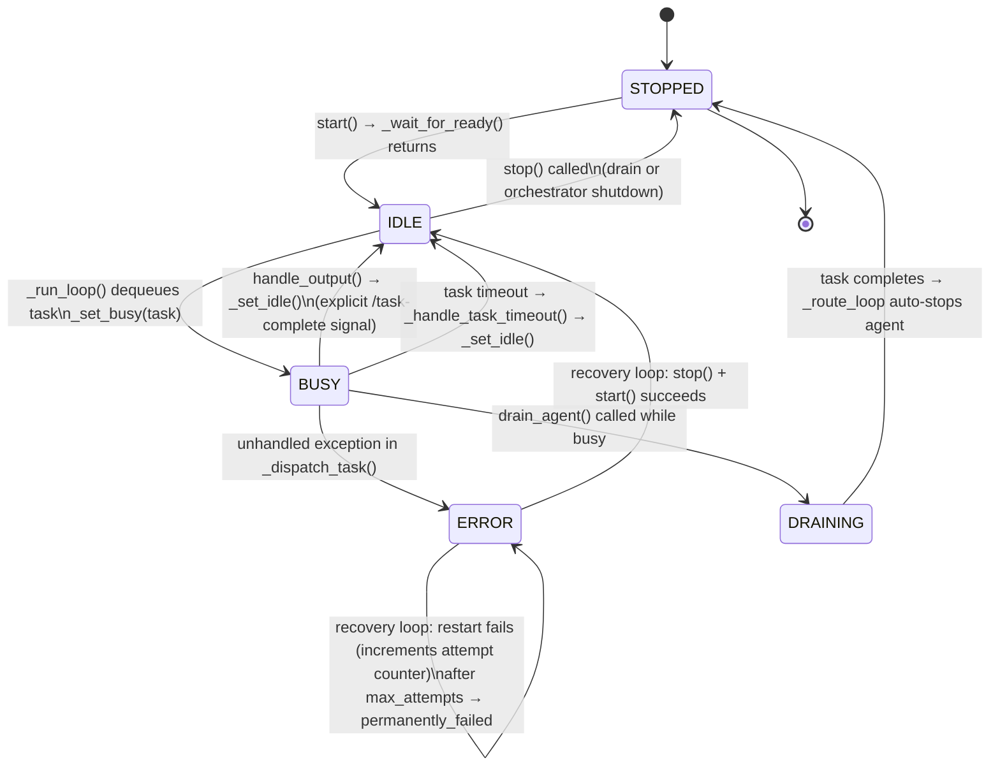
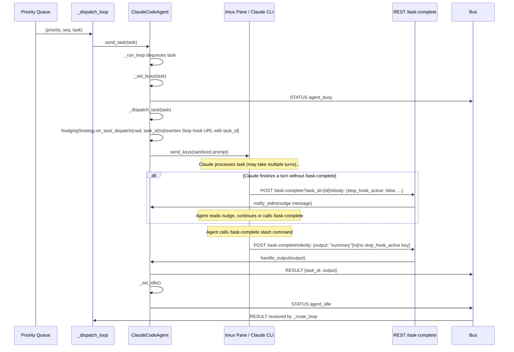

# Agent Lifetime Reference

This document describes the complete lifecycle of a `ClaudeCodeAgent` — from creation through to shutdown — as implemented in TmuxAgentOrchestrator.

---

## Table of Contents

1. [Overview](#1-overview)
2. [AgentStatus state machine](#2-agentstatus-state-machine)
3. [Creation and startup](#3-creation-and-startup)
4. [Task dispatch](#4-task-dispatch)
5. [Inter-task period (IDLE)](#5-inter-task-period-idle)
6. [Sub-agent spawning](#6-sub-agent-spawning)
7. [Shutdown](#7-shutdown)
8. [Director agent differences](#8-director-agent-differences)
9. [Error and timeout handling](#9-error-and-timeout-handling)
10. [Configuration reference](#10-configuration-reference)

---

## 1. Overview

An **agent** in TmuxAgentOrchestrator is a `ClaudeCodeAgent` instance: a Python object that drives a `claude` CLI process running inside a dedicated tmux pane. Each agent maintains its own isolated git worktree (by default), receives tasks from the orchestrator's priority queue, executes them by sending the task prompt as input to the pane, waits for completion using a pluggable `CompletionStrategy`, and then signals the result back to the orchestrator via the async pub/sub bus.

The orchestrator manages a registry of agents, a priority queue of pending tasks, and a set of background loops (dispatch, routing, watchdog, recovery) that together ensure tasks are delivered to idle agents, results are routed back to callers, timed-out agents are recovered, and misbehaving agents are circuit-broken. An agent's lifetime — from `start()` to `stop()` — maps directly to the lifetime of the tmux pane and git worktree that underpin it.

---

## 2. AgentStatus state machine

### States

| State | Meaning |
|---|---|
| `STOPPED` | Initial state; agent has not been started, or has been shut down. |
| `IDLE` | Agent is running, has no current task, and is available for dispatch. |
| `BUSY` | Agent is executing a task. |
| `ERROR` | An unhandled exception occurred inside `_dispatch_task`. The recovery loop will attempt a restart. |
| `DRAINING` | Agent has been asked to stop gracefully; it will not receive new tasks and will be stopped when its current task finishes. |

### Transitions

| From | To | Trigger |
|---|---|---|
| `STOPPED` | `IDLE` | `start()` completes successfully (`_wait_for_ready()` returns) |
| `IDLE` | `BUSY` | `_run_loop()` dequeues a task and calls `_set_busy(task)` |
| `BUSY` | `IDLE` | `handle_output()` is called (agent sends explicit `/task-complete` signal) → `_set_idle()` |
| `BUSY` | `IDLE` | Task timeout fires → `_handle_task_timeout()` → `_set_idle()` |
| `BUSY` | `ERROR` | Unhandled exception in `_dispatch_task()` |
| `BUSY` | `DRAINING` | `drain_agent()` called while agent is busy |
| `DRAINING` | `STOPPED` | Current task completes → orchestrator `_route_loop` calls `agent.stop()` |
| `IDLE` | `STOPPED` | `drain_agent()` called while idle → immediate `stop()` |
| `IDLE` | `STOPPED` | `orchestrator.stop()` calls `agent.stop()` |
| `ERROR` | `IDLE` | Recovery loop: `agent.stop()` + `agent.start()` succeeds |
| `ERROR` | `ERROR` | Recovery loop: restart fails; attempt counter incremented |
| Any | `STOPPED` | `stop()` called directly |

Note: `_set_idle()` will not transition to `IDLE` if the status is already `STOPPED`, `ERROR`, or `DRAINING` — those states are sticky and only the recovery loop or explicit `stop()` can exit them.

### Mermaid state diagram



---

## 3. Creation and startup

`ClaudeCodeAgent.start()` runs the following steps in order. All blocking operations (libtmux calls, filesystem writes, subprocess waits) are run in a thread-pool executor so the asyncio event loop is never blocked.

### 3.1 API key injection into tmux session environment

If an `api_key` was provided, `_set_session_env_api_key()` calls `libtmux Session.set_environment("TMUX_ORCHESTRATOR_API_KEY", api_key)` **before** creating the pane. This ordering is mandatory: `tmux set-environment` only propagates to panes created after the call; panes created before it do not inherit the variable. The environment variable is used by the Stop hook HTTP headers to authenticate with the REST API.

### 3.2 Pane allocation

- **Top-level agent** (`parent_pane is None`): `TmuxInterface.new_pane(agent_id)` creates a new tmux window in the session, returning a `libtmux.Pane`.
- **Sub-agent** (`parent_pane` is set): `TmuxInterface.new_subpane(parent_pane, agent_id)` splits the parent's window horizontally, keeping both agents visible in the same tmux window.

### 3.3 Worktree setup

`_setup_worktree()` is called, which delegates to `WorktreeManager.setup(agent_id, isolate=self._isolate)`:

- **`isolate=True`** (default): creates `{repo_root}/.worktrees/{agent_id}/` as a git worktree on a new branch named `worktree/{agent_id}`. If a leftover path or branch exists from a previous run it is forcibly cleaned before creating a fresh one. The path is returned and stored as `self.worktree_path`.
- **`isolate=False`**: returns the main `repo_root` unchanged; no git operations are performed.
- **`_cwd_override` set** (sub-agent sharing parent worktree): the override path is returned directly; `WorktreeManager` is bypassed and no teardown is registered for this agent.

### 3.4 Files written to the worktree

After the worktree path is established (`cwd`), the following files are written in this order:

| File | Writer method | Condition | Purpose |
|---|---|---|---|
| `__orchestrator_context__.json` | `_write_context_file(cwd)` | Always (if `cwd` is not None) | Agent ID, mailbox directory, session name, `web_base_url`. **API key is intentionally excluded.** |
| `__orchestrator_api_key__` | `_write_api_key_file(cwd)` | If `api_key` is non-empty | Raw API key, written with `os.open()` at `0o600` to prevent umask-widened permissions. |
| `CLAUDE.md` | `_write_agent_claude_md(cwd)` | Only for isolated agents (`isolate=True`) | Role-specific instructions (see [Section 8](#8-director-agent-differences) for Director vs Worker differences). Includes identity, communication protocol, working conventions, slash command reference, and optionally `system_prompt` content and `context_files` list. |
| `NOTES.md` | `_write_notes_template(cwd)` | Always, unless file already exists | Structured note-taking template. Not overwritten if the agent is being recovered/restarted into an existing worktree. |
| context files | `_copy_context_files(cwd)` | If `context_files` is non-empty | Copies literal file paths from `context_files_root` into the worktree, preserving relative directory structure. |
| context spec files | `_copy_context_spec_files(cwd)` | If `context_spec_files` is non-empty | Copies files matching glob patterns from `context_spec_files_root` (cold-memory specification documents). |
| `.claude/settings.local.json` | `completion.on_start(cwd)` | Worker agents only (`NudgingStrategy`) | Stop hook configuration pointing at `POST /agents/{id}/task-complete`. When Claude finishes a response turn without calling `/task-complete`, the endpoint sends a nudge via `notify_stdin`. Not written for Director agents (`ExplicitSignalStrategy` — no-op). |
| `.claude/commands/*.md` | `_copy_slash_commands(cwd)` | Always (if `src/tmux_orchestrator/commands/` exists) | Copies all bundled slash commands into `{cwd}/.claude/commands/` so they are discoverable by Claude Code in the worktree. |

The Stop hook JSON written to `.claude/settings.local.json` looks like this:

```json
{
  "hooks": {
    "Stop": [
      {
        "matcher": "",
        "hooks": [
          {
            "type": "http",
            "url": "http://localhost:8000/agents/{agent_id}/task-complete",
            "timeout": 5,
            "headers": {
              "X-Api-Key": "$TMUX_ORCHESTRATOR_API_KEY"
            },
            "allowedEnvVars": ["TMUX_ORCHESTRATOR_API_KEY"]
          }
        ]
      }
    ]
  }
}
```

### 3.5 Claude process launch

The launch command is assembled as:

```
cd {cwd} && env -u CLAUDECODE claude --dangerously-skip-permissions
```

(`CLAUDECODE` is stripped from the environment so the nested `claude` process does not detect that it is already inside a Claude Code session.) The string is sent to the pane via `TmuxInterface.send_keys(pane, launch)`. `watch_pane()` and `start_watcher()` activate the daemon thread that polls pane output and forwards it to the bus.

A custom `command` field in `AgentConfig` replaces the default `env -u CLAUDECODE claude --dangerously-skip-permissions`.

### 3.6 `_wait_for_ready()`

After launching `claude`, the startup method polls the pane every `_POLL_INTERVAL` (0.5 s) until output settles for `_SETTLE_CYCLES` (3) consecutive polls and `looks_done()` returns `True`:

- `looks_done()` matches: `❯\s*$`, `>\s*$`, `Human:\s*$`, or `^\$\s*$` at end-of-line.
- If the workspace trust dialog appears (`"I trust this folder"` and `"Enter to confirm"` are both present in the pane output), `_wait_for_ready()` auto-accepts by sending `""` (Enter) to the pane and resets the settle counter.

### 3.7 Status transition to IDLE

After `_wait_for_ready()` returns, `self.status = AgentStatus.IDLE` is set directly (the only direct status write; all subsequent changes go through `_set_busy`/`_set_idle`).

### 3.8 Background tasks started

```python
self._run_task = asyncio.create_task(self._run_loop(), ...)
await self._start_message_loop()   # creates self._msg_task
```

Both tasks run concurrently for the agent's entire lifetime.

---

## 4. Task dispatch

### 4.1 How a task arrives

Tasks reach an agent via one of two paths:

1. **Orchestrator dispatch loop** (`_dispatch_loop`): dequeues `(priority, seq, task)` from the priority queue, selects an idle worker (respecting `target_agent`, `required_tags`, `target_group`), then calls `await agent.send_task(task)`, which enqueues the task into the agent's internal `_task_queue`.
2. **REST API** (`POST /tasks`): calls `orchestrator.submit_task(...)` which puts the task into the orchestrator priority queue; from there it follows path 1.

### 4.2 `_run_loop()`: dequeue → BUSY → dispatch → result

```
while status not in (STOPPED, ERROR):
    task = await _task_queue.get()        # blocks until a task arrives
    _set_busy(task)                        # status = BUSY, _current_task = task
    publish STATUS "agent_busy"
    if task_timeout:
        await wait_for(_dispatch_task(task), timeout=task_timeout)
    else:
        await _dispatch_task(task)
    # on TimeoutError → _handle_task_timeout(task) → _set_idle()
    # on other exception → status = ERROR
    # on normal return → status already set to IDLE by handle_output()
    if status == IDLE:
        publish STATUS "agent_idle"
```

### 4.3 `_dispatch_task()`: completion strategy + send_keys + wait

```python
async def _dispatch_task(self, task: Task) -> None:
    # 1. Notify completion strategy so it can update per-task Stop hook URL
    self._completion.on_task_dispatch(self._cwd, task.id)

    # 2. Sanitize and send the prompt to the pane
    safe_prompt = sanitize_prompt(task.prompt)
    self._tmux.send_keys(self.pane, safe_prompt)

    # 3. Wait for completion
    await self._completion.wait(self, task)
```

`on_task_dispatch()` for `NudgingStrategy` rewrites `.claude/settings.local.json` with a task-scoped URL:

```
http://localhost:8000/agents/{agent_id}/task-complete?task_id={task_id}
```

This URL includes the `task_id` query parameter so that a stale Stop hook fired from a *previous* task carries the wrong `task_id` and is rejected by the endpoint — preventing spurious nudges.

### 4.4 Completion detection strategies

Three `CompletionStrategy` classes exist. The factory `make_completion_strategy(role, ...)` selects the correct one:

| Role | Strategy | Stop hook written? | How task completes |
|---|---|---|---|
| `WORKER` | `NudgingStrategy` | Yes | Explicit `/task-complete` call only |
| `DIRECTOR` | `ExplicitSignalStrategy` | No | Explicit `/task-complete` call only |
| (deprecated) | `StopHookStrategy` | Yes | Polling fallback (not used in production) |

Both production strategies use an identical pure spin-wait:

```
while True:
    sleep 0.5s
    if _current_task is None or changed:  return
```

No pane output is captured inside `wait()`. Task completion is **always** an explicit deliberate act by the agent.

#### NudgingStrategy (Worker agents)

`NudgingStrategy` writes `.claude/settings.local.json` so the Claude Code Stop hook fires when Claude finishes each response turn. The Stop hook POSTs to `POST /agents/{agent_id}/task-complete?task_id={task_id}` with a body that includes the `stop_hook_active` key.

The endpoint (`agent_task_complete`) distinguishes call sources by the **presence** of `stop_hook_active` in the request body:

| Body | Meaning | Endpoint action |
|---|---|---|
| `stop_hook_active=True` | Claude mid-tool-call continuation | Skip (no-op) |
| `stop_hook_active=False` | Claude finished a response turn | **Nudge** — `notify_stdin(...)` |
| No `stop_hook_active` key | Explicit `/task-complete` slash command | **Complete** — `handle_output(output)` |

The nudge message injected into the pane:

```
__ORCHESTRATOR__: Your task is still open (task_id=<prefix>).
If all work is complete and artefacts are committed, call:
    /task-complete <one-line summary>
If you still have work to do, please continue.
```

The task only completes when the agent calls the `/task-complete` slash command, which sends a POST body **without** the `stop_hook_active` key.

`handle_output()` publishes a `MessageType.RESULT` on the bus and calls `_set_idle()`:

```python
async def handle_output(self, text: str) -> None:
    msg = Message(type=RESULT, from_id=self.id,
                  payload={"task_id": task_id, "output": text})
    await self.bus.publish(msg)
    self._set_idle()
```

#### ExplicitSignalStrategy (Director agents)

No Stop hook is written. No nudge mechanism. The only way to complete the task is for the Director to call the `/task-complete` slash command (or equivalent curl):

```bash
curl -s -X POST http://localhost:8000/agents/{agent_id}/task-complete \
  -H 'X-Api-Key: $TMUX_ORCHESTRATOR_API_KEY' \
  -H 'Content-Type: application/json' \
  -d '{"output": "one-line summary"}'
```

The REST endpoint calls `agent.handle_output(output)` which publishes the RESULT and calls `_set_idle()`, which the `ExplicitSignalStrategy.wait()` loop detects on the next 0.5 s tick.

### 4.5 Sequence diagram: worker task dispatch



---

## 5. Inter-task period (IDLE)

Between tasks, the agent sits blocked inside `asyncio.Queue.get()` in `_run_loop`. The agent's status is `IDLE` and it is eligible for dispatch.

Concurrently, the **message loop** (`_message_loop`) is subscribed to the bus on `agent.id`. When a directed bus message arrives (a `PEER_MSG` routed to this agent's ID), the loop:

1. Calls `self.mailbox.write(self.id, msg)` to persist the message to the filesystem mailbox (`{mailbox_dir}/{session_name}/{agent_id}/inbox/`).
2. Calls `self.notify_stdin(f"__MSG__:{msg.id}")` which sends the notification string to the tmux pane via `send_keys`. Claude Code sees this text in its stdin and knows to check its inbox.

The agent is also subject to:
- **Context monitor**: polls pane output size, estimates token count, publishes `context_warning` events, and optionally auto-injects `/summarize` into the pane.
- **Drift monitor**: tracks pane output changes; publishes `agent_drift_warning` if the composite drift score falls below `drift_threshold`.

---

## 6. Sub-agent spawning

Sub-agents are spawned when a running agent sends the `/spawn-subagent <template_id>` slash command (or when the REST `POST /agents` endpoint is called with a `SpawnAgent` body).

### 6.1 Flow

1. The `/spawn-subagent` slash command publishes a `CONTROL` message to the bus:
   ```json
   {"action": "spawn_subagent", "template_id": "<template_id>"}
   ```
2. The orchestrator's `_route_loop` detects `msg.type == CONTROL` and dispatches to `_handle_control(msg)`.
3. `_handle_control` looks up `template_id` in `self.config.agents`. If not found, logs an error and returns.
4. `_spawn_subagent(parent_id, template_cfg)` is called:
   - Generates `sub_id = f"{parent_id}-sub-{uuid4().hex[:6]}"`.
   - Creates a new `Mailbox` instance.
   - Retrieves the parent agent's `pane` and `worktree_path`.
   - Instantiates a new `ClaudeCodeAgent` with:
     - `parent_pane=parent_agent.pane` (causes `new_subpane()` to split the parent's window)
     - `worktree_manager=effective_wm` (the shared `WorktreeManager`, or `None` if sharing parent worktree)
     - `cwd_override=parent_agent.worktree_path` (only if `share_parent_worktree=True`)
     - All other config fields copied from `template_cfg`
   - Calls `self.registry.register(agent, parent_id=parent_id)`.
   - Calls `self.registry.grant_p2p(parent_id, sub_id)` to auto-grant bidirectional P2P permission between parent and sub-agent.
   - Calls `await agent.start()` — which runs the full startup sequence described in [Section 3](#3-creation-and-startup).
5. Publishes a `STATUS` message `subagent_spawned` to the bus (directed to the parent agent's ID), which lands in the parent's mailbox and triggers `__MSG__:{id}` in the parent's pane.

### 6.2 Pane layout

A sub-agent calls `new_subpane(parent_pane, agent_id)`, which splits the parent's tmux window. Both the parent and the sub-agent are visible in the same window, separated by a horizontal split.

---

## 7. Shutdown

`ClaudeCodeAgent.stop()` performs the following steps:

### 7.1 Status set to STOPPED

```python
self.status = AgentStatus.STOPPED
```

This causes `_run_loop()` to exit on its next iteration (it checks `status not in (STOPPED, ERROR)`).

### 7.2 Run loop and message loop tasks cancelled

```python
self._run_task.cancel()
self._msg_task.cancel()
```

Pending tasks in the internal `_task_queue` are abandoned (the orchestrator's watchdog or DLQ will handle any tasks that were dispatched but never completed).

### 7.3 Graceful `claude` exit

```python
self._tmux.send_keys(self.pane, "q", True)
```

Sends the `q` key to the pane (the `True` flag adds a carriage return), which gracefully exits the Claude interactive session.

### 7.4 Pane unwatch

```python
self._tmux.unwatch_pane(self.pane)
```

Removes the pane from the watcher thread's tracking set so no further output events are published.

### 7.5 Bus unsubscription

```python
await self.bus.unsubscribe(self.id)
```

Removes the agent's subscription queue from the bus so the message loop receives no more messages.

### 7.6 Completion strategy cleanup

```python
if self.worktree_path is not None:
    self._completion.on_stop(self.worktree_path)
```

`NudgingStrategy.on_stop(cwd)` (Worker) deletes `.claude/settings.local.json` so that any in-flight Stop hook fired after shutdown does not reach a stale endpoint. `ExplicitSignalStrategy.on_stop()` (Director) is a no-op.

### 7.7 Worktree teardown

```python
await self._teardown_worktree()
```

Delegates to `WorktreeManager.teardown(agent_id, merge_to_base=self._merge_on_stop, merge_target=self._merge_target)`:

- If `merge_on_stop=True`: performs `git merge --squash worktree/{agent_id}` into the main repo (optionally checking out `merge_target` branch first), then commits the squash result. Falls back gracefully if there are no new commits or if conflicts occur.
- Runs `git worktree remove --force {path}` to remove the worktree directory.
- Runs `git branch -D worktree/{agent_id}` to delete the branch.
- For shared-worktree agents (`isolate=False`): only removes the agent from the `_shared` tracking set; no git operations are performed.

---

## 8. Director agent differences

A Director agent is created with `role=AgentRole.DIRECTOR` in `AgentConfig`. This changes the following behaviors:

### Completion strategy

`make_completion_strategy(AgentRole.DIRECTOR, ...)` returns `ExplicitSignalStrategy` instead of `NudgingStrategy`:
- No `.claude/settings.local.json` Stop hook is written at startup.
- No nudge mechanism — the Director is expected to call `/task-complete` without prompting.
- `wait()` spins until `_current_task` is cleared; no pane output polling.

### CLAUDE.md content

The Director's `CLAUDE.md` contains an additional API Quick Reference section and prominently includes the explicit task-complete curl command:

```bash
curl -s -X POST http://localhost:8000/agents/{agent_id}/task-complete \
  -H 'X-Api-Key: $TMUX_ORCHESTRATOR_API_KEY' \
  -H 'Content-Type: application/json' \
  -d '{"output": "<one-line summary of what was accomplished>"}'
```

The Director is instructed to call this **only once**, after verifying all workers are IDLE (`GET /agents`) and all expected files exist.

### Workflow

1. Director receives a task from the orchestrator queue (same path as workers).
2. Director uses multi-turn Claude responses to: run `/plan`, spawn sub-agents, submit tasks via `POST /tasks`, receive results via mailbox (`__MSG__:<id>` notifications), aggregate results.
3. Director explicitly signals completion via the curl command above.
4. `ExplicitSignalStrategy.wait()` detects `_current_task` cleared, `_dispatch_task` returns, and `_run_loop` transitions the director back to IDLE.

---

## 9. Error and timeout handling

### 9.1 Per-task timeout (`task_timeout`)

When `task_timeout` is set, `_run_loop()` wraps `_dispatch_task(task)` in `asyncio.wait_for(..., timeout=task_timeout)`. On `asyncio.TimeoutError`:

```python
async def _handle_task_timeout(self, task: Task) -> None:
    await self.bus.publish(Message(
        type=RESULT,
        from_id=self.id,
        payload={"task_id": task.id, "error": "timeout", "output": None},
    ))
    self._set_idle()
```

The agent returns to IDLE and the orchestrator's `_route_loop` receives the error RESULT.

### 9.2 Unhandled exception in `_dispatch_task`

If any exception other than `asyncio.TimeoutError` propagates from `_dispatch_task`, `_run_loop` catches it:

```python
except Exception:
    self.status = AgentStatus.ERROR
    publish STATUS "agent_error"
```

The agent stops accepting tasks. The `_run_loop` checks `status not in (STOPPED, ERROR)` at the top of each iteration, so it exits the loop and the agent sits in ERROR.

### 9.3 Watchdog loop

The orchestrator's `_watchdog_loop` polls every `watchdog_poll` seconds (default 10 s). It calls `registry.find_timed_out_agents(task_timeout)`, which returns agents that have been BUSY for more than `1.5 × task_timeout` seconds. For each such agent it publishes a synthetic `RESULT` with `error="watchdog_timeout"` — bypassing the agent's own timeout mechanism. The existing `_route_loop` handles this RESULT identically to a real agent RESULT.

### 9.4 Recovery loop

The `_recovery_loop` polls every `recovery_poll` seconds (default 2 s) for agents in ERROR state. For each:

1. Increments a per-agent attempt counter.
2. If `attempt > recovery_attempts` (default 3): marks the agent as permanently failed, publishes `agent_recovery_failed`, and skips it forever.
3. Otherwise: waits `backoff_base ^ attempt` seconds (default: 5, 25, 125 s), calls `agent.stop()`, then `agent.start()`. If the agent reaches IDLE within the allotted wait, resets the attempt counter and publishes `agent_recovered`. Otherwise logs a warning and leaves the agent to be retried on the next loop iteration.

### 9.5 Circuit breaker

`AgentRegistry` maintains a consecutive-error counter per agent. After `circuit_breaker_threshold` consecutive errors (default 3), the agent is "open" and `find_idle_worker()` skips it. After `circuit_breaker_recovery` seconds (default 60 s), the circuit half-opens and the agent is eligible again. This prevents the dispatch loop from repeatedly routing tasks to a persistently failing agent.

### 9.6 Drain and DRAINING state

When `drain_agent(agent_id)` is called on a BUSY agent:
- Sets `agent.status = AgentStatus.DRAINING`.
- Adds the agent ID to `_draining_agents`.
- When `_route_loop` next receives a RESULT from this agent, it calls `agent.stop()` and `registry.unregister(agent_id)`, then publishes `agent_drained`.

`_set_idle()` checks that the status is not already `DRAINING` before changing it — so a DRAINING agent cannot accidentally become IDLE again.

---

## 10. Configuration reference

The following `AgentConfig` fields directly affect an agent's lifetime behavior:

| Field | Type | Default | Effect on lifetime |
|---|---|---|---|
| `isolate` | `bool` | `True` | `True`: git worktree created at `.worktrees/{id}/` on branch `worktree/{id}`. `False`: agent uses the main repo root; no worktree git operations. |
| `merge_on_stop` | `bool` | `False` | When `True` and `isolate=True`: squash-merges the agent's branch into the main repo at teardown. Commits made by the agent persist after it stops. |
| `merge_target` | `str \| None` | `None` | Branch to merge into when `merge_on_stop=True`. `None` = current HEAD. |
| `task_timeout` | `int \| None` | `None` | Per-agent task timeout in seconds. Overrides `OrchestratorConfig.task_timeout` when set. `None` inherits the orchestrator-level default. |
| `role` | `AgentRole` | `WORKER` | `WORKER`: uses `NudgingStrategy` (Stop hook as nudge trigger; task completes via explicit `/task-complete`). `DIRECTOR`: uses `ExplicitSignalStrategy` (no Stop hook; explicit `/task-complete` required). Also changes `CLAUDE.md` content. |
| `system_prompt` | `str \| None` | `None` | Additional instructions appended as a "Role-Specific Instructions" section in `CLAUDE.md`. |
| `context_files` | `list[str]` | `[]` | Relative file paths copied from `context_files_root` into the worktree at startup. |
| `context_spec_files` | `list[str]` | `[]` | Glob patterns expanded from `context_spec_files_root` and copied into the worktree at startup (cold-memory spec documents). |
| `command` | `str \| None` | `None` | Custom command to launch the agent process. Defaults to `env -u CLAUDECODE claude --dangerously-skip-permissions`. |
| `tags` | `list[str]` | `[]` | Capability tags. Tasks with `required_tags` are only dispatched to agents whose `tags` include ALL required tags. |
| `groups` | `list[str]` | `[]` | Named agent groups the agent is pre-registered into at orchestrator startup. |

The following `OrchestratorConfig` fields also affect agent lifetime:

| Field | Type | Default | Effect |
|---|---|---|---|
| `task_timeout` | `int` | `120` | Global task timeout (seconds). Used when `AgentConfig.task_timeout` is `None`. |
| `circuit_breaker_threshold` | `int` | `3` | Consecutive errors before an agent is circuit-broken. |
| `circuit_breaker_recovery` | `float` | `60.0` | Seconds before a circuit-broken agent is retried. |
| `watchdog_poll` | `float` | `10.0` | Seconds between watchdog checks. |
| `recovery_attempts` | `int` | `3` | Max restart attempts for an ERROR agent before it is permanently failed. |
| `recovery_backoff_base` | `float` | `5.0` | Exponential backoff base (seconds); attempt N waits `backoff_base ^ N`. |
| `dlq_max_retries` | `int` | `50` | Max dispatch retries before a task is dead-lettered. |
